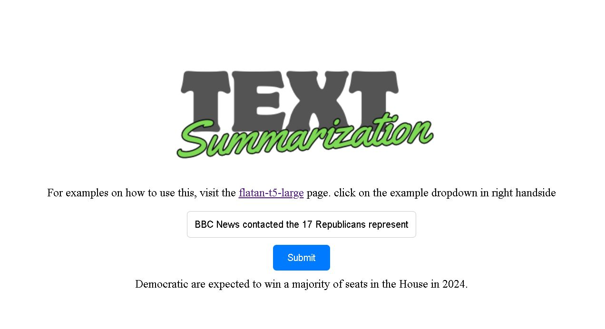

# Flask Text Summarizer

In this project I have utilized the [google/flan-t5-large]([https://textsummarizer-yd7x.onrender.com/](https://huggingface.co/google/flan-t5-large?text=Translate+to+German%3A++My+name+is+Arthur)) model from google that is avilable in hugging face. this website makes a call in to the model to send the text from the website to the model's api endpoint and captures the response and show in the website.

# Objective
- Applying skill to work with api
- Learning How to interact with huggingface APIs
- How the api and frontend work together

## Table of Contents
- [Setup & Installation](#setup--installation)
- [Running The App](#running-the-app)
- [Viewing The App](#viewing-the-app)
- [Screenshots](#screenshots)

## Setup & Installation

1. **Clone the Repository:**
   ```bash
   git clone https://github.com/fahamidur/laughing-octo-carnival.git
   cd laughing-octo-carnival
   ```

2. **Install Dependencies:**
   ```bash
   pip install -r requirements.txt
   ```

## Running The App

Now that you have the app and its dependencies installed, let's run it!

```bash
python app.py
```

## Viewing The App

Open your web browser and navigate to [http://127.0.0.1:5000](http://127.0.0.1:5000).

You should now see the Flask Notes App up and running. If it's your first time, you might want to create an account, log in, and start adding notes.

You can go to this link to check the app running [https://textsummarizer-yd7x.onrender.com/](https://textsummarizer-yd7x.onrender.com/).


## Screenshots
<!-- Add your screenshots here. -->

*App demo*

